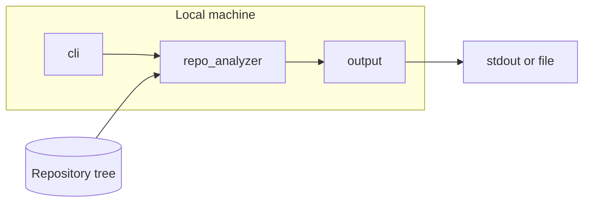
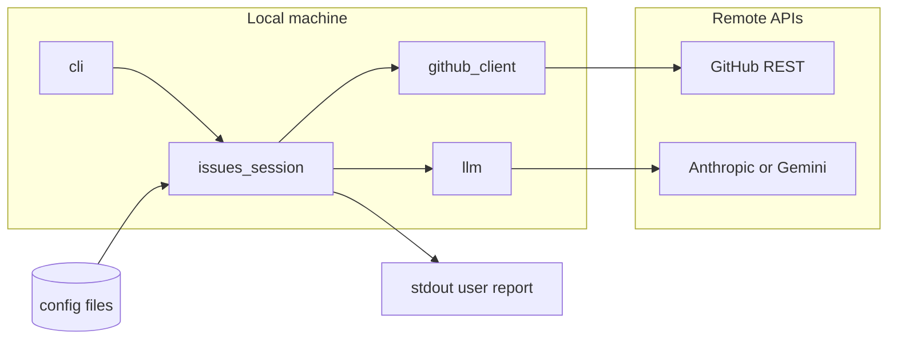

# Technical Report — secanalyzer Codebase Architecture

**Audience:** Technical stakeholders presenting system design and implementation.  
**Scope:** Repository layout, components, control flows, and engineering choices as implemented in this codebase.

---

## 1. Executive summary

**secanalyzer** is a **local command-line application** (Python 3.11+) that helps engineers:

1. **Document a repository** via `--scan`: walk an on-disk tree under strict rules, emit **Markdown** (compact inventory, optional redacted excerpts, optional LLM narrative).
2. **Triage GitHub work** via `--issues`: list **open issues and pull requests**, drive a **keyboard UI**, call a **remote LLM** (Anthropic or Google) with **bounded context**, and print a **schema-validated** risk summary.

The implementation favors **stdlib `urllib`** for HTTP (no heavy HTTP client dependency for core paths), **`uv`** for reproducible environments, and **explicit error types** surfaced to the user without raw tracebacks.

---

## 2. System context

| Attribute | Description |
|-----------|-------------|
| **Deployment model** | Single-user CLI; no server component. |
| **Trust boundary** | User’s machine is trusted; **GitHub** and **LLM vendor APIs** are external. |
| **Secrets** | GitHub PAT and LLM keys live in the **OS user config directory** (see [config.py](../src/secanalyzer/config.py)); optional `SECANALYZER_CONFIG_DIR` for tests only. |
| **Outputs** | Scan: Markdown to stdout or `-o` file. Issues: human-readable sections to stdout; credentials never intentionally written there. |

---

## 3. Logical architecture (six components)

The codebase follows a **six-module decomposition** aligned with the original design specification (CLI, config, repo analysis, GitHub client, LLM orchestration, output).

| Component | Python module | Responsibility |
|-----------|---------------|----------------|
| **CLI** | [`cli.py`](../src/secanalyzer/cli.py) | `argparse` entrypoint; routes `--scan`, `--issues`, `--set-token`, `--api-key-status`; wraps recoverable failures as [`UserFacingError`](../src/secanalyzer/exceptions.py). |
| **ConfigManager** | [`config.py`](../src/secanalyzer/config.py) | Read/write `github_token` and `llm_credentials.json`; shape validation; GitHub token **live validation** via `GET /user` for `--api-key-status`. |
| **RepositoryAnalyzer** | [`repo_analyzer.py`](../src/secanalyzer/repo_analyzer.py) | Confined directory walk, extension allowlist, binary skip, UTF-8 decode, **regex redaction** (`redact_text`), Markdown report assembly. |
| **GitHub API client** | [`github_client.py`](../src/secanalyzer/github_client.py) | Paginated open issues/PR list; PR **files + patch** fetch with **hard caps** on bytes per patch and total payload. |
| **LLM orchestration** | [`llm.py`](../src/secanalyzer/llm.py) | Prompt construction with **delimiter blocks**; **~100k estimated-token budget**; **pre-send pattern scan**; Anthropic **Messages** and Gemini **generateContent** JSON mode; response **JSON schema** enforcement. |
| **Issues session / glue** | [`issues_session.py`](../src/secanalyzer/issues_session.py) | **questionary** menu loop; stitches GitHub data into LLM prompts; prints rendered analysis. |
| **OutputHandler** | [`output.py`](../src/secanalyzer/output.py) | UTF-8 write to stdout or path for scan reports. |

**Package entry:** [`__main__.py`](../src/secanalyzer/__main__.py) exposes `python -m secanalyzer`; console script `secanalyzer` is declared in [`pyproject.toml`](../pyproject.toml).

---

## 4. High-level data flows

### 4.1 Static repository scan (`--scan`)

1. User passes a **directory path**; CLI validates `--output` pairing.
2. **RepositoryAnalyzer** resolves the root, walks with **`followlinks=False`**, skips noisy directory names, keeps only **allowlisted extensions**.
3. File contents are **redacted** where patterns match; totals feed stderr **warnings** when redaction occurs.
4. **Deterministic Markdown inventory** is generated (file index and metadata; **not** full-file code listings by default).
5. If **LLM credentials** are stored, a **bounded inventory string** is built ([`build_scan_inventory_for_llm`](../src/secanalyzer/repo_analyzer.py)) and [`generate_repo_scan_markdown`](../src/secanalyzer/llm.py) requests a **concise Markdown narrative** from the vendor; failures degrade to inventory plus a warning.
6. **OutputHandler** writes the combined Markdown to stdout or `-o`.

### 4.2 GitHub issues / PR triage (`--issues`)

1. **Config** supplies GitHub token + stored LLM provider/key; **`--provider`** must match stored vendor when used with `--issues`.
2. **GitHub client** lists open items; for PRs, fetches **truncated** patch summaries.
3. **questionary** presents a **keyboard** menu; user selects an item (or Esc exits).
4. **LLM layer** builds **system + user** prompts with **explicit delimiters** around untrusted GitHub text, enforces **token budget**, runs **pre-send abort** if credential-shaped strings appear in the **full** outbound text, calls vendor API, **parses and validates JSON**.
5. Rendered Markdown-like sections print to **stdout**; LLM failures print **`[ERROR]`** to stderr and the loop can continue.

---

## 5. Key engineering decisions

| Decision | Rationale | Where enforced |
|----------|-----------|----------------|
| **No shell during scan** | Avoids shell injection from filenames; walk uses `os.walk`, paths are data. | [`repo_analyzer.py`](../src/secanalyzer/repo_analyzer.py) |
| **Path confinement** | Every visited file must be under resolved scan root (`relative_to`). | Same |
| **Extension allowlist** | Limits data exfiltration surface and noise. | `ALLOWED_EXTENSIONS` |
| **urllib + injectable `urlopen`** | Keeps HTTP stack thin; **tests** mock network without sockets. | [`config.py`](../src/secanalyzer/config.py), [`github_client.py`](../src/secanalyzer/github_client.py), [`llm.py`](../src/secanalyzer/llm.py) |
| **Token budget heuristic** | `len(text)//3` estimated tokens; binary search truncation of user block. | [`llm.py`](../src/secanalyzer/llm.py) |
| **JSON-only model contract** | Enables programmatic validation and rejects malformed or manipulative free text. | `validate_analysis_schema`, `parse_json_object_from_model` |
| **Typed user-facing errors** | `UserFacingError` hierarchy; CLI maps to stderr messages, exit codes 0/1/2/130. | [`exceptions.py`](../src/secanalyzer/exceptions.py), [`cli.py`](../src/secanalyzer/cli.py) |

---

## 6. Build, test, and CI

| Concern | Implementation |
|---------|----------------|
| **Packaging** | `setuptools`, `src/` layout, `pyproject.toml` + **`uv.lock`**. |
| **Dev tools** | `pytest`, `bandit`, `pip-audit` in the **dev** dependency group. |
| **CI** | [`.github/workflows/ci.yml`](../.github/workflows/ci.yml): `uv sync --frozen --all-groups`, then pytest, bandit on `src/secanalyzer`, pip-audit. |

---

## 7. Operational notes

- **WSL vs Windows:** A `.venv` created on Windows is **not** usable inside WSL (different layout). Use **`rm -rf .venv`** then **`uv sync`** in the environment you use, or keep **separate clones** per OS. See [QUICKSTART.md](../guides/QUICKSTART.md).
- **Optional model IDs:** `SECANALYZER_ANTHROPIC_MODEL`, `SECANALYZER_GEMINI_MODEL` (see [AGENTS.md](../../AGENTS.md)).
- **Operational logs:** The CLI writes sanitized JSONL events through [`operations.py`](../../src/secanalyzer/operations.py). Logs capture command lifecycle, scan counts, redaction hits, Bandit results, GitHub/LLM API failures, and retry pressure. Set `SECANALYZER_LOG_FILE`, `SECANALYZER_LOG_LEVEL`, or `SECANALYZER_LOG_DISABLE` to control behavior.

---

## 8. Gaps and evolution (for roadmap slides)

| Area | Current state |
|------|----------------|
| **Scan + LLM** | `--scan` always emits a short **deterministic inventory**; with LLM keys configured it **adds** a vendor-generated narrative from **bounded** excerpts (not the full tree). Optional `include_full_file_snippets=True` exists only for local debugging in [`report_to_markdown`](../src/secanalyzer/repo_analyzer.py). |
| **Live LLM key check** | `--api-key-status` validates GitHub remotely; LLM side is **format** validation, not a vendor ping. |
| **Telemetry** | No remote telemetry. Local JSONL operational logging exists for troubleshooting and presentation evidence; token-like fields are redacted before write. |

---

## 9. Reference index

| Document / path | Purpose |
|-----------------|--------|
| [README.md](../../README.md) | User-facing overview, CLI table, troubleshooting |
| [QUICKSTART.md](../guides/QUICKSTART.md) | Step-by-step first run |
| [SECURITY.md](../guides/SECURITY.md) | Data handling and disclosure |
| [AGENTS.md](../../AGENTS.md) | Maintainer/agent checklist and env vars |
| [docs/reports/SECURITY_REPORT.md](SECURITY_REPORT.md) | Threat-to-mitigation mapping |

---

*Generated from the repository state as of the report authoring date; line-level behavior may evolve with commits.*
